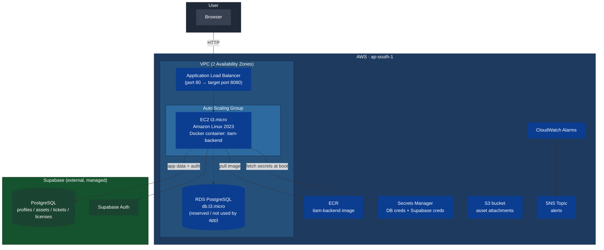

# ITAM Console — IT Asset Management System

A full-stack IT Asset Management (ITAM) console — track hardware assets, support
tickets, and software licenses from a single dashboard. Built as a standalone
web application and deployed on production-style AWS infrastructure using
Terraform.

**Live stack:** React (TanStack Start) → Docker → AWS (ALB + Auto Scaling +
EC2) → Supabase (Postgres + Auth)

---

## 1. What this project demonstrates

- Frontend engineering: React 18, TanStack Start (SSR), TanStack Router,
  Tailwind CSS
- Containerization: multi-stage Docker build, Node 22 runtime
- Cloud infrastructure as code: Terraform-managed AWS environment
  (VPC, ALB, Auto Scaling Group, RDS, ECR, Secrets Manager, S3, SNS, CloudWatch)
- Backend-as-a-service integration: Supabase (Postgres, Auth, Row-Level Security)
- Real-world debugging: dependency conflicts, environment-specific build
  presets, IAM/ECR auth issues, RDS engine deprecation, database migrations

---

## 2. Architecture



> **Note:** The Terraform stack provisions an RDS PostgreSQL instance as part
> of the reference architecture, but the application itself talks to
> **Supabase** (an external managed Postgres + Auth service) for all data and
> authentication. The RDS instance and its Secrets Manager entry are wired up
> and ready, but unused by the current app code — left in place for future
> use (e.g., a self-hosted Postgres migration).

---

## 3. Tech stack

| Layer | Technology |
|---|---|
| Frontend framework | React 18 + TanStack Start (SSR) + TanStack Router |
| Styling | Tailwind CSS |
| Build tool | Vite (custom config, no third-party wrapper) |
| Server runtime | Node 22, Nitro `node-server` preset |
| Auth & Database | Supabase (PostgreSQL + Auth, Row-Level Security) |
| Containerization | Docker (multi-stage build) |
| Container registry | AWS ECR |
| Compute | AWS EC2 (Auto Scaling Group, t3.micro, Amazon Linux 2023) |
| Load balancing | AWS Application Load Balancer |
| Secrets | AWS Secrets Manager |
| IaC | Terraform (~> 5.0 AWS provider) |
| Monitoring | CloudWatch Alarms + SNS |

---

## 4. Repository structure

```
IT_Asset_Management_Standalone/
├── src/
│   ├── routes/              # TanStack Router pages (__root, auth, dashboard, ...)
│   ├── integrations/
│   │   └── supabase/        # Supabase client (browser + server)
│   ├── server.ts             # SSR error-handling wrapper
│   └── start.ts              # TanStack Start middleware
├── public/
│   └── favicon.ico
├── supabase/
│   ├── config.toml           # Supabase project reference
│   └── migrations/           # SQL schema + RLS policies + seed data
├── vite.config.ts             # Standalone Vite config (no third-party wrapper)
├── Dockerfile                 # Multi-stage build → Node 22 runtime, port 8080
├── package.json
└── infra/
    └── terraform/
        ├── vpc.tf, alb.tf, asg.tf, rds.tf, ecr.tf, iam.tf
        ├── secrets.tf                    # DB + Supabase secrets
        ├── security_groups.tf, s3.tf, cloudwatch.tf, outputs.tf
        ├── variables.tf
        ├── terraform.tfvars.example       # copy → terraform.tfvars (never commit the real one)
        └── templates/
            └── user_data.sh.tpl           # EC2 boot script: fetch secrets, run container
```

---

## 5. Environment variables

| Variable | Used at | Purpose |
|---|---|---|
| `VITE_SUPABASE_URL` | Docker **build** time (`--build-arg`) | Baked into client JS bundle |
| `VITE_SUPABASE_PUBLISHABLE_KEY` | Docker **build** time (`--build-arg`) | Baked into client JS bundle (safe to expose — public/anon key) |
| `SUPABASE_URL` | Container **runtime** (`-e` / EC2 user-data) | Server-side Supabase client |
| `SUPABASE_PUBLISHABLE_KEY` | Container **runtime** | Server-side Supabase client |
| `SUPABASE_SERVICE_ROLE_KEY` | Container **runtime** | Full-access server-side key — **never** put in a `VITE_*` build arg |
| `PORT` | Container runtime | Defaults to `8080` |

Get the Supabase values from: **Supabase Dashboard → Project Settings → API**.

---

## 6. Running locally

```powershell
cd IT_Asset_Management_Standalone
npm install
npm run build          # sanity-check the build

# Build the Docker image (client keys baked in at build time)
docker build --no-cache `
  --build-arg VITE_SUPABASE_URL="<your-supabase-url>" `
  --build-arg VITE_SUPABASE_PUBLISHABLE_KEY="<your-publishable-key>" `
  -t itam-backend .

# Run it (server-side keys passed at runtime)
docker run -d -p 8080:8080 --name itam-test `
  -e PORT=8080 `
  -e SUPABASE_URL="<your-supabase-url>" `
  -e SUPABASE_PUBLISHABLE_KEY="<your-publishable-key>" `
  -e SUPABASE_SERVICE_ROLE_KEY="<your-secret-key>" `
  itam-backend
```
Visit `http://localhost:8080`.

### Database setup (required once per Supabase project)
Run both files in `supabase/migrations/` **in order**, in the Supabase
**SQL Editor**. The first creates the schema, RLS policies, and seed data;
the second locks down a helper function's execute permissions.

---

## 7. Deploying to AWS

```powershell
# 1. Configure AWS CLI
aws configure

# 2. Provision the ECR repository first (chicken-and-egg: ASG needs an image, image needs ECR)
cd infra/terraform
terraform init
terraform apply -target=aws_ecr_repository.app

# 3. Build & push the image (see section 6 for the build command)
$AccountId = (aws sts get-caller-identity --query Account --output text)
aws ecr get-login-password --region ap-south-1 | docker login --username AWS --password-stdin "${AccountId}.dkr.ecr.ap-south-1.amazonaws.com"
docker tag itam-backend:latest "${AccountId}.dkr.ecr.ap-south-1.amazonaws.com/itam-backend:latest"
docker push "${AccountId}.dkr.ecr.ap-south-1.amazonaws.com/itam-backend:latest"

# 4. Copy terraform.tfvars.example → terraform.tfvars and fill in Supabase keys

# 5. Provision everything else (VPC, ALB, ASG, RDS, Secrets Manager, ...)
terraform apply -var-file terraform.tfvars

# 6. Update Supabase Auth → URL Configuration → Site URL to the ALB DNS name
#    (terraform output alb_dns_name)

# 7. When done, tear it all down to stop billing
terraform destroy -var-file terraform.tfvars
```

---

## 8. Troubleshooting log (issues hit & fixed during this deployment)

A record of real issues encountered — useful both as a personal reference and
as evidence of debugging ability.

| Issue | Root cause | Fix |
|---|---|---|
| Build produced a Cloudflare Worker, not a Node server | Default Vite config wrapper targeted `cloudflare-module` preset | Set `nitro: { preset: "node-server" }` in `vite.config.ts` |
| Broken relative imports (`../styles.css`, `../lib/...`) | File paths didn't match actual project layout | Corrected import paths in `__root.tsx`, `server.ts`, `start.ts` |
| App crashed instantly in the browser ("This page didn't load") | Missing `SUPABASE_URL` / `SUPABASE_PUBLISHABLE_KEY` at runtime and build time | Passed both as Docker build-args (client) and `-e` runtime vars (server) |
| Docker Desktop wouldn't start | WSL2 backend distros (`docker-desktop`, `docker-desktop-data`) missing | Installed a WSL distro, reinstalled Docker Desktop, re-registered WSL integration |
| `docker login` returned 400 Bad Request | `--password-stdin` pipe mishandling in this environment | Used `--password $env:VAR` instead of piping |
| `terraform apply` — "already exists" errors (ECR, IAM role/policies, subnet group, secret, target group) | Resources survived from an earlier interrupted session; fresh Terraform state didn't know about them | `terraform import` for each resource; RDS instance itself was deleted and recreated (its subnet group couldn't be reused across a destroyed VPC) |
| RDS creation failed: "Cannot find version 16.4 for postgres" | AWS deprecated that minor version in the region | Queried `aws rds describe-db-engine-versions` and set `db_engine_version` to a currently supported `16.x` |
| Supabase "Invalid API key" | Copy/paste or stale Docker build cache | Rebuilt with `--no-cache` and re-verified keys via direct `curl` calls |
| Auth email confirmation link pointed to the wrong host | Supabase **Site URL** still set to an old address | Updated Site URL / Redirect URLs to match the current deploy target each time it changed |
| Email confirmation rate-limited | Supabase's shared/default mailer has a low hourly limit | Disabled "Confirm email" in Authentication → Providers for this dev/portfolio project |
| "Add Asset" blocked, "Raise Ticket" failed | New Supabase project's tables/policies were never actually created (`user_roles` did not exist) | Re-ran both migration files in the SQL Editor end-to-end; manually backfilled `admin` role for the account created before the migration existed |
| Removing the "Continue with Google" button | It used Lovable's own Cloud Auth service, which only works inside Lovable's hosting | Removed the button, its handler, and the `@lovable.dev/*` packages entirely; rewrote `vite.config.ts` without the Lovable wrapper |

---

## 9. Cost & cleanup notes

- Free-tier eligibility depends on **when the AWS account was created**
  (pre- vs post-July 2025 changed the model — check your Billing dashboard).
- The NAT Gateway and Application Load Balancer are **not** free-tier
  eligible regardless of account age.
- Always run `terraform destroy -var-file terraform.tfvars` after taking
  screenshots/demos to avoid ongoing charges.
- Rotate or delete any IAM access keys that were ever pasted into a terminal
  transcript, chat log, or screenshot before sharing those files publicly.

---

## 10. Screenshots

See the accompanying folders for deployment evidence:
- `WEB/` — live application (landing page, sign-in, dashboard)
- `AWS CONSOLE/` — EC2, ASG, ALB/Target Groups, RDS, VPC, ECR, Secrets Manager, CloudWatch
- `CLI Commands/` — Terraform apply, Docker build/push, AWS CLI output
- `DOCKER/` — Docker Desktop, image build
- `supbase/` — Supabase dashboard (API keys page, Auth settings)
